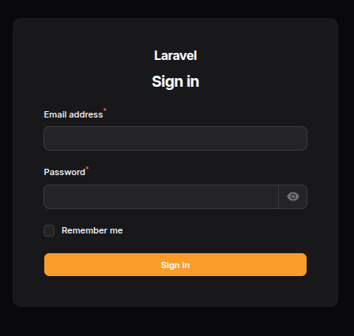
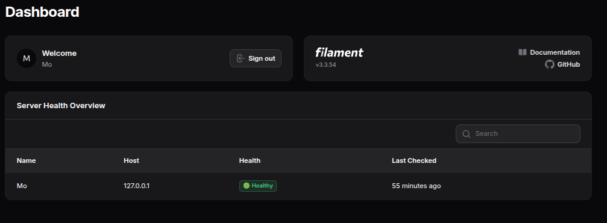

<p align="center">
  
</p>
# ServerPlus

**Free, open-source, agentless infrastructure monitoring for DevOps engineers.**

ServerPlus lets you monitor your Linux servers over SSH — no agents to install, no accounts to create, no data leaving your machine. Every engineer runs their own private instance, connects it to their own servers, and gets real-time health monitoring with alerts sent straight to their own email or Telegram.


---

## Why ServerPlus?

- **Agentless.** Connects over SSH — nothing to install on the servers you monitor.
- **Private by design.** Runs entirely on your own machine. Your server credentials never leave your computer.
- **Free and open source.** MIT licensed. Clone it, run it, modify it.
- **Real checks.** CPU, RAM, disk usage, and uptime — pulled live over SSH, not simulated.
- **Real alerts.** Get notified by email (or Telegram) the moment a server crosses a critical threshold.
- **One command to run.** Docker handles everything — build, migrate, and launch.

---

## Features

- 🖥️ **Server management** — add, edit, group, and remove servers from a clean admin panel
- 📊 **Live health checks** — CPU, RAM, disk, and uptime monitored on a schedule
- 🚦 **Visual health indicators** — instant 🟢 Healthy / 🟡 Warning / 🔴 Critical / ⚫ Offline status
- 🔔 **Alerting** — configurable warning/critical thresholds per check, with email and Telegram delivery
- 📜 **Alert history** — full log of triggered alerts, with the ability to mark them resolved
- 🔐 **Encrypted credentials** — SSH private keys are encrypted at rest using Laravel's built-in encryption
- ⚙️ **Admin dashboard** — built on [Filament](https://filamentphp.com/), a modern Laravel admin panel

---

## Screenshots


<p align="center">

  

</p>

<p align="center">

  

</p>


## Tech Stack

| Layer | Technology |
|---|---|
| Backend | Laravel 12 (PHP 8.3+) |
| Admin Panel | Filament 3 |
| Database | SQLite |
| SSH | phpseclib3 |
| Queue | Laravel Queue (database driver) |
| Scheduler | Laravel Scheduler |
| Containerization | Docker & Docker Compose |

---

## Quick Start (Docker — Recommended)

The fastest way to get ServerPlus running. Docker builds the app, runs migrations, creates an admin user, and starts everything for you.

### Prerequisites

- [Docker](https://docs.docker.com/get-docker/) and [Docker Compose](https://docs.docker.com/compose/install/) installed

### Run it

```bash
git clone https://github.com/motarekdevops/ServerPlus.git
cd ServerPlus
./start.sh
```

This will:
1. Build the Docker image
2. Run database migrations
3. Create a default admin user
4. Start the queue worker and scheduler
5. Launch the app and open your browser automatically

Once it's up, log in at **http://localhost:8000/admin** with:

- **Email:** `admin@serverplus.local`
- **Password:** `password`

> ⚠️ Change this password immediately after your first login.

To stop the app:
```bash
docker compose down
```

---

## Manual Installation (Without Docker)

If you'd rather run it natively:

### Prerequisites

- PHP 8.3+
- Composer
- SQLite

### Steps

```bash
git clone https://github.com/motarekdevops/ServerPlus.git
cd ServerPlus

composer install

cp .env.example .env
php artisan key:generate

touch database/database.sqlite
php artisan migrate

php artisan make:filament-user
```

Then, in three separate terminal windows:

```bash
# Terminal 1 — the app
php artisan serve

# Terminal 2 — queue worker (runs the SSH checks)
php artisan queue:work

# Terminal 3 — scheduler (triggers checks every 5 minutes)
php artisan schedule:work
```

Visit **http://localhost:8000/admin** and log in with the account you created.

---

## How It Works

1. **Add a server** — provide a host, SSH username, and private key through the admin panel. Choose which checks to run (CPU, RAM, disk, uptime).
2. **Scheduler runs every 5 minutes** — dispatches a background job for each server.
3. **Job connects over SSH** — pulls live metrics using standard Linux commands (`top`, `free`, `df`, `/proc/uptime`).
4. **Check engine evaluates the result** — compares it against your warning/critical thresholds.
5. **Alerts fire on critical status** — a record is saved, and a notification is sent via email and/or Telegram, based on your settings.
6. **Dashboard updates live** — the admin panel shows real-time server health with color-coded indicators.

---

## Configuring Alerts

Go to **Admin Panel → Alert Settings** to configure how you want to be notified:

- **Email** — enter the address alerts should be sent to. Configure your SMTP credentials in `.env` (`MAIL_HOST`, `MAIL_USERNAME`, `MAIL_PASSWORD`, etc.). Works with Gmail, Mailtrap, or any SMTP provider.
- **Telegram** — enter your bot token (create one via [@BotFather](https://t.me/BotFather)) and your chat ID (find yours via [@userinfobot](https://t.me/userinfobot)).

---

## Security Notes

- SSH private keys are encrypted at rest using Laravel's `encrypted` model cast (AES-256).
- Each instance is fully private — there is no central server, no telemetry, and no shared database between users.
- This project is intended to be **self-hosted only**. Do not expose your instance to the public internet without adding your own authentication hardening.

---

## Roadmap

- [ ] Intrusion / attack detection (failed login analysis, suspicious command patterns)
- [ ] Docker container monitoring
- [ ] SSL certificate expiry checks
- [ ] Multi-user support with role-based access

---

## Contributing

Contributions, issues, and feature requests are welcome. Feel free to open a pull request or an issue.

---

## License

This project is licensed under the MIT License.

---

## Author

Built by **Mo** ([@motarekdevops](https://github.com/motarekdevops))
